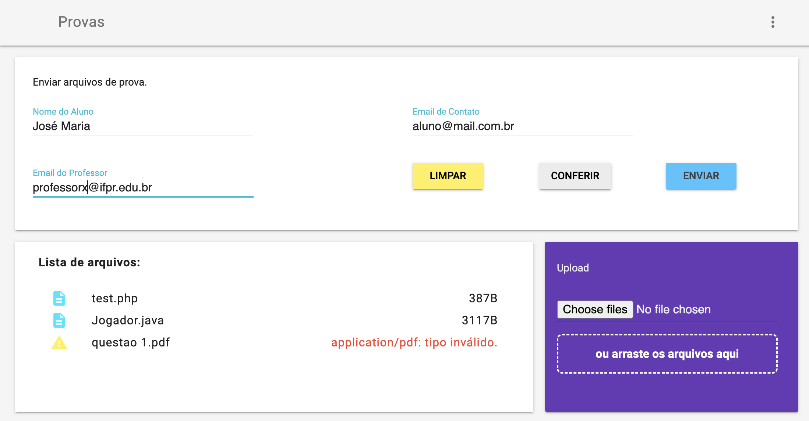

# send-files
File Sender - Generate HTML file from uploaded files and send to an email. We provide the project to teachers that want to compile the codes of its students into one file.

# Preview:

# Contribute

Feel free to collaborate with us, contribute to the project, copy, use and improve.